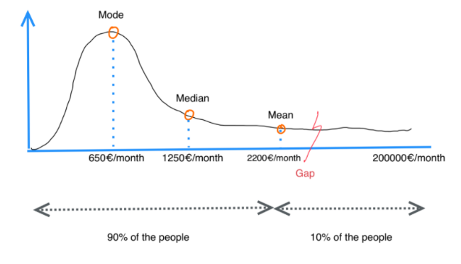
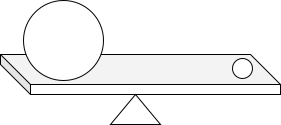

# Probability distribution in social networks

The graphic below represents how the monthly income is distributed among the people in a country. Numbers are not accurate at all, but the graphic is very convenient to visualize the distribution. 

The "wealth distribution phenomenon" is universal in human interactions and creations. Let's analyze and understand first the metrics.

## The Mean

We all have seen the mean. The mean is a widely used metric that we have seen a lot in our day to day life. A wasy intuitive way to understand the mean is to think of the ceter of mass. Let's consider the following situation:

We have two balls that are placed on a table. The first ball is placed at the left and the second ball is placed at the right. The goal is to put a triangle somewhere in order to make the whole system to be in equilibrium, that is to say that the balls and the table do not move. Since the left ball weights more than the right one, you probably would intuitivelly put the triangle closer to the big ball.

You see it? The point where the triangle is can be seen as the mean.

## The Mode

The mode is the most likely value. In first figure, the mode is in the top of the distribution (650€/month). That means that most of the people in that country gets around 650€/month.

## The Median

The median is the true equilibrium point. In the first figure, the median is the line that separates the two halves of the distribution. The median is also known as the quantile 50%.

## The power law and its properties

Let's zoom in on the first figure. If we take the distribution from where the "mode" is till the end, we have a long tail distribution. 

This long tail distribution comes describe what is called the power law.

The power law, also called the 80-20 rule or the scalling law, states that a relative change in one quantity results in a proportional relative change in another. The simplest example of the law in action is a square; if you double the length of a side (say, from 2 to 4 inches) then the area will quadruple (from 4 to 16 inches squared).

A power law distribution has the form $Y = k X\alpha$, where:

* $X$ and $Y$ are variables of interest,
* $α$ is the law’s exponent,
* $k$ is a constant

The interesting thing about power laws is that they can be used to describe a wide variety of phenomenon, and even in the cases where a power law isn't entirely correct it may still be a useful approximation.
