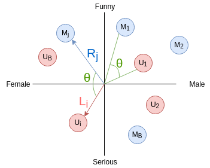

# Recomendation Systems

Given a bipartite graph we would like to find similarities between product and users. This is used a lot in websites we all use in our daily life such as, Netflix, Amazon, etc. So basically we just our system to recomend content based on the behaviour of the users in order to keep the users consuming/buying whatever the website is offering. There are 2 main approaches for recomendation systems:

* Correlation Efficiency, which is fast and dirty:
    $$ E{(x - \hat{x}) (y - \hat{y})}$$

* Projection in Subspace Method (more complicated): It uses the projections that we have seen in the previous chapters. 
> While the most of well known websites that make intensive use of recomendation systems such as Netflix or Facebook, use the Subspace Method, others like Amazon have a problem of scale, so they use a mix of both.

The goal of a recommendation system is to fill up a Recommendation Matrix $\mathbf{R}$ which at the beggining will be a sparse matrix. The matrix $\mathbf{R}$ users in the rows and products in the columns.

The $r_{ij}$ corresponds to the recommendation of the product {j} to user {i}. The matrix will have a low-power distribution in the columns, because, for example in the case of Netflix, there will be less  successful movies that will not be watched by a lot of users. We have to think that each user has not watched a lot of films. It means that in the matrix there would be a huge amount of zeros, so we need to fill them up with the recommendations.

The subspace projection method consists on project both users and products onto the same subspace so that we can compute distance between users themselves, between products themselves and between users and products. We can take a look in the figure below to understand it: For user $U_{1}$, movie $M_{1}$ is a good recommendation, but for user $U_{i}$ , movie $M_{1}$ is a bad  recommendation (it would give us a negative score).

Computing the angle $\theta$ can give us the similarities. $R_{j}$ is the vector that goes for the movie $M_{j}$ , and $L_{i}$ is the vector that goes to the user $U_{i}$ . These vectors will be in a subspace that will allow us to reconstruct the original Recommendation Matrix. Finally we store the users in the latent matrix $\mathbf{L}$, and movies in the latent matrix $\mathbf{R}$. We measure the similarity by multiplying $\mathbf{L^{T}_{i}}\mathbf{R_{j}}$.