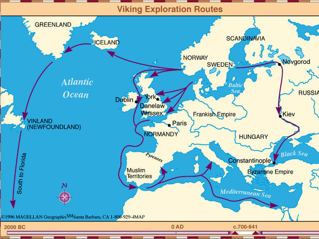

# Ranking Systems on a Graph I. Accessibility and Circularity

In this serie of essays we are going to describe how the google search engine works at a high level. We will try to understand the mathematical intuition behind the Google's search engine, and try to understand a bit more what is going under the hood.

In order to do so, we will start defining two concepts that will be useful to understand the Google algorithm later. Those are **accessibily** and **circularity**.

## Accessibility. Linear Algebra in Geography

To get an intuition on what accessibility is, we will think about the Vikings atacking the citiy of Constantinople. The Vikings, to get there, they had to cross all Europe through Russia to finally get to the city that today is Istambul. Wars apart, one thing that Vikings realised was that with such a long journey, there were some strategic middle points. One of this points is the city of Moscow, because it is a city that they where crossing every time they tried to travel to/from Constantinopla.

Leaving the ~~probably wrong~~ historic details aside, we can think of the journeys of the vikings in a **form of graph**, where the **nodes** are **cities/camps** and the **links** are the **paths** from one city/camp to the next one. Then, it can be said that Moscow is an **accessible** node in the Vikings' journeys graph.

  
_Viking explotration routes. [source](https://rutaporlahistoriablog.blogspot.com/2016/01/vikingos.html)_

So, if we count all possible paths that travesses a city, then we have a **rank index**, i.e., a way to classify the "importance" of the nodes on the graph. It lets us a way to answer the question "How accessible is this node from others nodes in the network" or "What is its relative geographical importance in the network?" which in some context (like a war) are important questions to answer at.

## Circularity. Football Pools

Let's say that we want to do a football pool. In order to win, we need some criterion to decide wether team A will win against team B. Let's see a what has happened with team A/B in the past, so we have something to base our decision on.

* Team A has won 10 times against weak times on the league.
* Team A has lost with only one strong team.
* Team B has won one strong team, but has tied with all other strong teams of the leage.

Perhaps, intuition says that team B will win team A, because team B has not lost against any strong team. On the other hand, team A has lost many games, but when they played against a weak time, they have lost.

Anyhow, football pools apart, the important here is to illustrate that, whatever ranking will we use to rank the teams, we can say for sure that the ranking of team X has to do with its results in the past. But it also has to do with the results that their rivals have performed. Then, **how strong is a team, depends on how strong are the others**

In a more general way, we can say that **the team ranking I am making, is proportional to the ranking of my connections**. And here is where **circularity** comes to the game. Although the concept is easy to understand, circularity comes with its drawbacks. But we will deal with the the inconveniences of circularity in next essays in later.

## The maths of Google's search algorithm

The basic idea of the Google algorithm is based on this two concepts in a very high level. Summarizing, these are the underlaying ideas on Google's algorithm:

* A web page is important if it is pointed by important pages.

* A web page is important if it is travessed by a "random surfer". (Like Moscow in the vikings example: it's not the destiniy of the journey of the vikings, but it is a node that is usually travessed by them).
