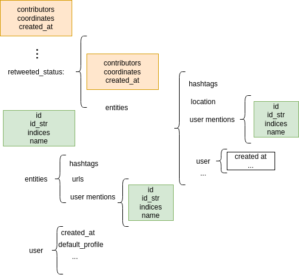

# Anatomy of a Tweet. Homework Answers

**1. Write de dependence tree of the dictionary that represents the whole tweet.**
*Note that in order to get all the entities you should look at more than one tweet.*



**2. Which kind of graphs could you construct of dependencies in a big enough set of related tweets?**

We could create bipartite graphs by relating different attributes, e.g. users and hashtags, users and locations, etc.

**3. What could you do with the 'retweeted_status' information?**

If `retweeted_status=false`, then we have a dangling node. This fact gives us information about the connectivity of the nodes.

**4.Create a dataframe with a column with the identity of the user and a column with the identity of the user mentioned in the tweet. Use (Future): creating an graph with an implicit relation. Finally order the DataFrame by the number of followers of the user.**

```python
db_mentions_df = DataBase_df[['user.id_str','entities.user_mentions', 'user.followers_count']]
db_mentions_df['entities.user_mentions'] = db_mentions_df['entities.user_mentions'].apply(lambda x: [j['id_str'] for j in x] if len(x)>0 else None)
db_mentions_df.sort_values(by='user.followers_count', ascending=False)
```

**5. Write in paper/typewriting how a graph users->hastag could be made.**
*Note that now we have a bipartite graph, i.e. users -> hashtag*

Regarding the graph for users, we should collect data that relate users to each other, it could take into account different types of relationships as we have seen previously.

On the other hand, some relationships between hastags. In order to do so, them could be related when/how often they appear next to other tags and if the topic that they refer to is related.


**6. Write on paper/typewriting a proposal of how it could be implemented with dictionaries**

To implement the data needed to create graphics, users, and hashtags, we would need a database, e.g., with padas DF which is very convenient, and clean up the columns. Then, we need to store the following attributes:

* User ID
* User ID of the users folowed by the user
* Hastag included on the tweet.